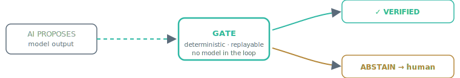

 

# Kyal McAuliffe — EcoKure / JARVI3

I build small, deterministic **verification gates**: tools that check a
specific class of claim or artifact and give the same answer every run —
no model in the loop, no network, and (for the Python tools) no dependencies
beyond the standard library. The thesis: **AI proposes, gates verify.**
A language model's output should pass through an explicit, replayable check
before anyone trusts, publishes, or exports it.

Every repo below runs in under a minute from a fresh clone. Every one carries
an explicit `LIMITATIONS.md` (or equivalent) stating what a passing verdict
does **not** prove.

 

## What I'm building

**[JARVI3](https://jvi3.com)** — an AI platform, **public beta, live now**.
Energy-efficient inference architecture with the verification-gate layer
above sitting in front of it: the model proposes, the gates verify, every
answer is checked before it's trusted.

**EcoKure Pty Ltd** — the company behind JARVI3. Registered, operating, and
**open for business** — partnerships, licensing, and enterprise engagements
welcome. Reach out at the email below or through [jvi3.com](https://jvi3.com).

 

## The gates — what each one checks

| Repo | Input | Deterministic verdict on |
|------|-------|--------------------------|
| [unitgate](https://github.com/kyal102/unitgate) | a physics equation, e.g. `E = m * a` | dimensional consistency (exact rational exponents) |
| [elementgate](https://github.com/kyal102/elementgate) | a chemical formula or reaction | well-formedness, molar mass, atom + charge balance |
| [statsgate](https://github.com/kyal102/statsgate) | a reported mean / SD / t-statistic | GRIM, SD-achievability, and t/p-value consistency — catches impossible or fabricated statistics |
| [chipgate](https://github.com/kyal102/chipgate) | a Verilog RTL file | structural defects: undriven outputs, multi-driven signals, latch risks, blocking/nonblocking misuse |
| [claimlint](https://github.com/kyal102/claimlint) | a README or doc | unsupported / overclaimed / data-free claims (CLI + GitHub Action) |
| [claimgate](https://github.com/kyal102/claimgate) | a free-text AI science claim | claim extraction + routing to the gate above that applies |

## The evidence layer — how results stay honest

| Repo | What it does |
|------|--------------|
| [evidencepack](https://github.com/kyal102/evidencepack) | seals a check result into hash-stamped JSON (what was checked, by which tool, verdict) |
| [replaygate](https://github.com/kyal102/replaygate) | re-runs a sealed pack with an allowlisted command and reports match or drift |
| [claimstack-demo](https://github.com/kyal102/claimstack-demo) | one pipeline: route → check → seal → replay, end to end |

## Larger demos & benchmarks

- [medgate](https://github.com/kyal102/medgate) / [orbitgate](https://github.com/kyal102/orbitgate) — Next.js demo UIs routing medical / orbital claims through explicit rules (demos, not certified tools)
- [dtl-security-benchmark](https://github.com/kyal102/dtl-security-benchmark) — 166 deterministic security-gate test cases across 8 CWE families

These public repos are lite editions; the full engine (JARVI3, at
[jvi3.com](https://jvi3.com)) is private.

 

 

📫 kyal11105@gmail.com · Brisbane, Australia

