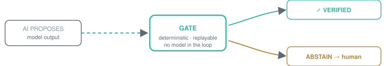

 

# Kyal McAuliffe — Jarvi3.com / DTL Verification Systems

I build deterministic verification gates for AI, science, security, and high-consequence workflows.

> **AI proposes. Gates verify. Evidence records. Replay checks drift.**

The public system is designed around a simple boundary: a model may propose an answer, but the final verdict should come from an explicit, inspectable check. Each gate says what it checks, what it cannot establish, and what validation is still required.

## What the system does

A DTL/JARVI3 verification flow is:

1. **Intake** — receive a claim, artifact, report, input, or model output.
2. **Route** — select the narrow gate that applies.
3. **Verify** — run a deterministic rule, parser, benchmark, or allowlisted check.
4. **Seal** — record the input, tool, version, verdict, limitations, and certificate hash.
5. **Replay** — rerun the check later and report a match, drift, unsafe command, or missing evidence.
6. **Review** — hand the result to the domain expert, operator, or approval workflow.

A passing gate means **this specific check passed**. It does not automatically mean scientific truth, clinical safety, regulatory compliance, commercial success, or production readiness.

## The gate stack

| Gate | Input | Deterministic result |
|---|---|---|
| [ClaimGate](https://github.com/kyal102/claimgate) | Free-text AI or science claim | Extracts claims and routes them to the applicable gate. |
| [ClaimLint](https://github.com/kyal102/claimlint) | README, documentation, or PR text | Flags unsupported, overconfident, and data-free wording. |
| [UnitGate](https://github.com/kyal102/unitgate) | Physics equation | Checks dimensional consistency using exact rational exponents. |
| [ElementGate](https://github.com/kyal102/elementgate) | Chemical formula or reaction | Checks syntax, molar mass, atoms, and charge balance. |
| [StatsGate](https://github.com/kyal102/statsgate) | Reported statistics | Checks arithmetic and consistency conditions for reported results. |
| [ChipGate](https://github.com/kyal102/chipgate) | Verilog RTL | Checks structural hazards and common unsafe patterns. |
| [MedGate](https://github.com/kyal102/medgate) | Medical-claim demo input | Demonstrates explicit routing and evidence boundaries; not clinical software. |
| [OrbitGate](https://github.com/kyal102/orbitgate) | Orbital or satellite claim | Demonstrates deterministic space-domain checks; not flight software. |

## The evidence and replay layer

| Component | Purpose |
|---|---|
| [EvidencePack](https://github.com/kyal102/evidencepack) | Seals what was checked, by which tool, with what verdict into hash-stamped JSON. |
| [ReplayGate](https://github.com/kyal102/replaygate) | Replays a sealed pack and reports match, drift, unsafe execution, or missing fields. |
| [ClaimStack Demo](https://github.com/kyal102/claimstack-demo) | Shows the full route → check → seal → replay pipeline. |
| [DTL Security Benchmark](https://github.com/kyal102/dtl-security-benchmark) | Reproducible security-gate tests across high-consequence input-validation families. |

EvidencePack separates two useful fingerprints:

- **certificate hash** — the verified result and normalized input;
- **evidence-pack hash** — the complete receipt, including provenance and replay instructions.

That makes a result inspectable, diffable, and replayable instead of relying on a screenshot or an opaque model explanation.

## JARVI3 Packages Labs

JARVI3 Packages Labs is the product surface where domain-specific gate demos can be explored together. MedGate and OrbitGate show the pattern:

- a user or model proposes a claim;
- the application routes it to an explicit domain gate;
- the gate returns a bounded verdict;
- the evidence layer records what happened;
- replay makes later drift visible;
- the interface shows limitations and next validation steps.

The public repositories are lite editions for evaluation, education, integration work, and independent review. The private JARVI3 deployment may provide the surrounding platform, orchestration, and product experience. The public demos do not claim certification.

## Why this matters to large companies

The useful enterprise question is not “does the model sound confident?” It is:

> Can the organisation show what was checked, by which version, against which input, with which limitations, and reproduce the result later?

The gate architecture is intended to support:

- **AI governance:** explicit refusal states such as NEEDS_DATA and UNSUPPORTED_CLAIM;
- **research and engineering QA:** deterministic checks before publication or export;
- **security assurance:** allowlisted replay commands and inspectable failure states;
- **data provenance:** inputs, normalization, versions, and certificates recorded together;
- **regulated workflows:** clear separation between automated checks and human/domain approval;
- **integration:** small CLIs, Python packages, GitHub Actions, dashboards, and same-origin product embedding.

The design goal is not to replace experts. It is to give experts a better evidence trail.

## Benchmark and assurance standard

A serious gate should publish:

- a narrow statement of what it checks;
- positive and negative test cases;
- a reproducible command;
- version and dependency information;
- known failure modes;
- an explicit limitation statement;
- an evidence or replay artifact;
- a clear path for external review.

The [DTL Security Benchmark](https://github.com/kyal102/dtl-security-benchmark) is the security-oriented example of this standard: fixed cases, transparent scoring, repeatable execution, and a visible distinction between a measured result and a broad marketing claim.

## What this is — and is not

This is verification infrastructure and research software. It is not:

- a replacement for clinical judgment, scientific peer review, experiment, or field validation;
- a guarantee that an AI system is safe in every context;
- a certification body or regulatory approval;
- a claim that every public demo is production-ready.

The public repos are intentionally small, inspectable, and limitation-first. The full private engine and advanced mechanics remain private.

## Start here

- **Understand the thesis:** [ClaimGate](https://github.com/kyal102/claimgate)
- **Run the end-to-end flow:** [ClaimStack Demo](https://github.com/kyal102/claimstack-demo)
- **Inspect evidence receipts:** [EvidencePack](https://github.com/kyal102/evidencepack)
- **Test reproducibility:** [ReplayGate](https://github.com/kyal102/replaygate)
- **See a product-domain demo:** [MedGate](https://github.com/kyal102/medgate) · [OrbitGate](https://github.com/kyal102/orbitgate)
- **Review the security benchmark:** [DTL Security Benchmark](https://github.com/kyal102/dtl-security-benchmark)
- **Learn about JARVI3:** [jarvi3.com](https://jarvi3.com)

## Working with JARVI3

JARVI3 / EcoKure is open to serious technical discussion, independent review, partnerships, licensing conversations, and enterprise evaluation. Start through [jarvi3.com](https://jarvi3.com) or the repository issue trackers.

📫 kyal11105@gmail.com · Brisbane, Australia

**AI proposes. Gates verify. Unsupported claims do not survive.**
